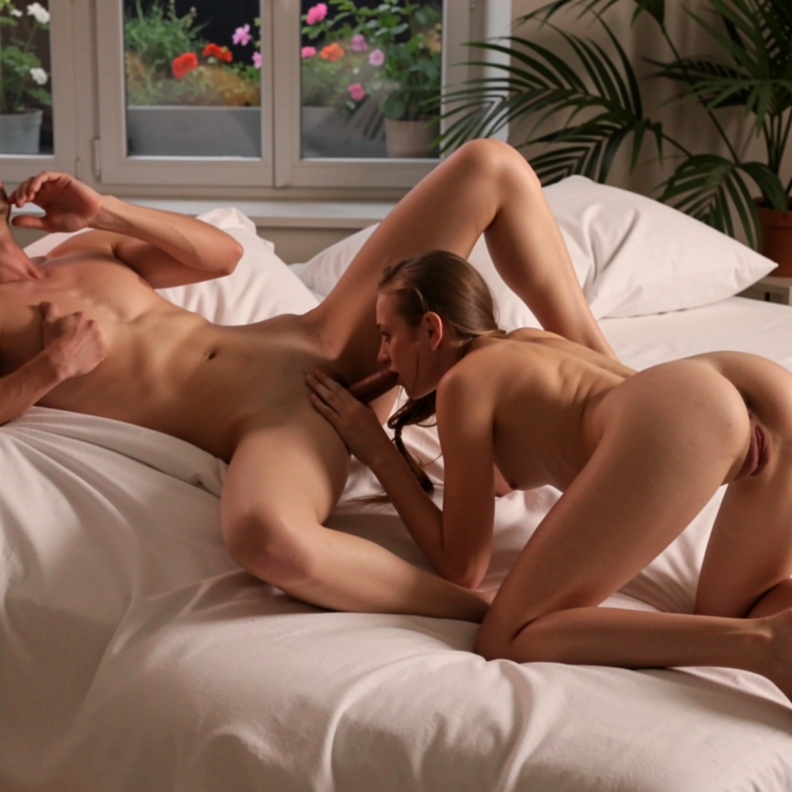
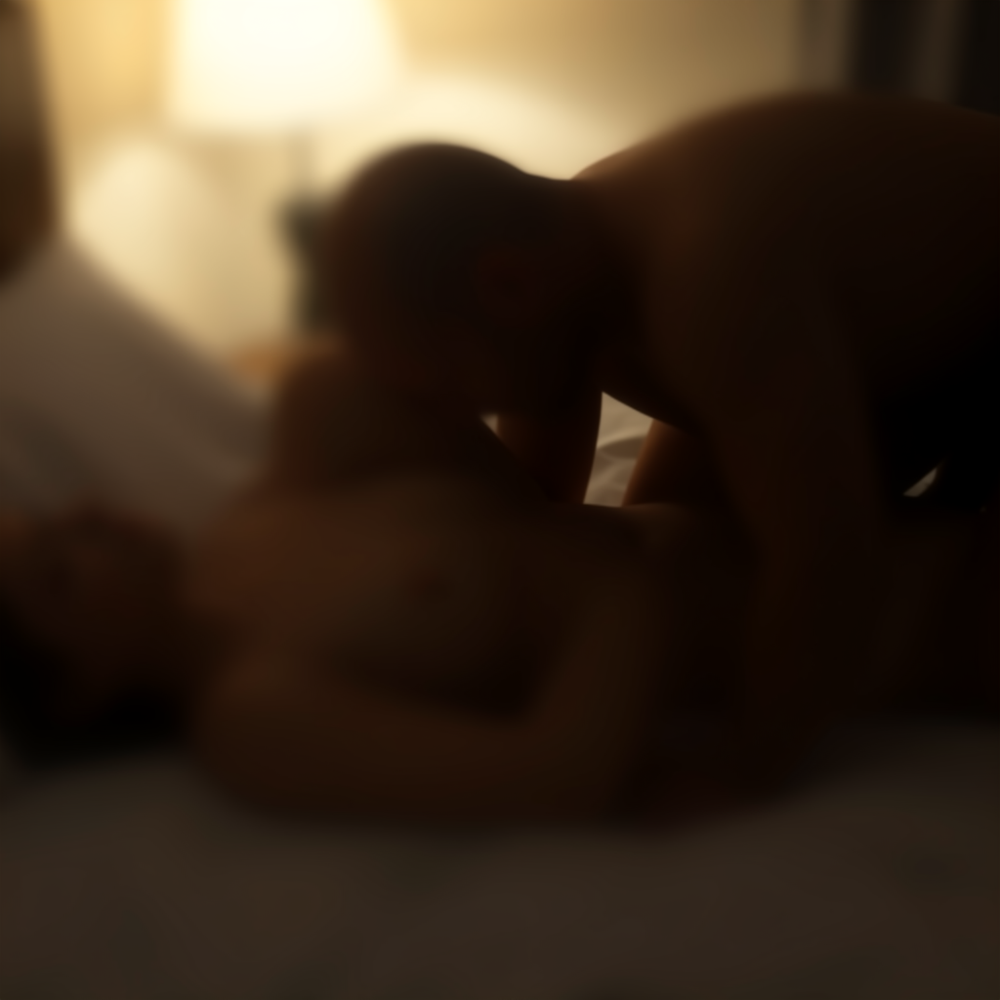
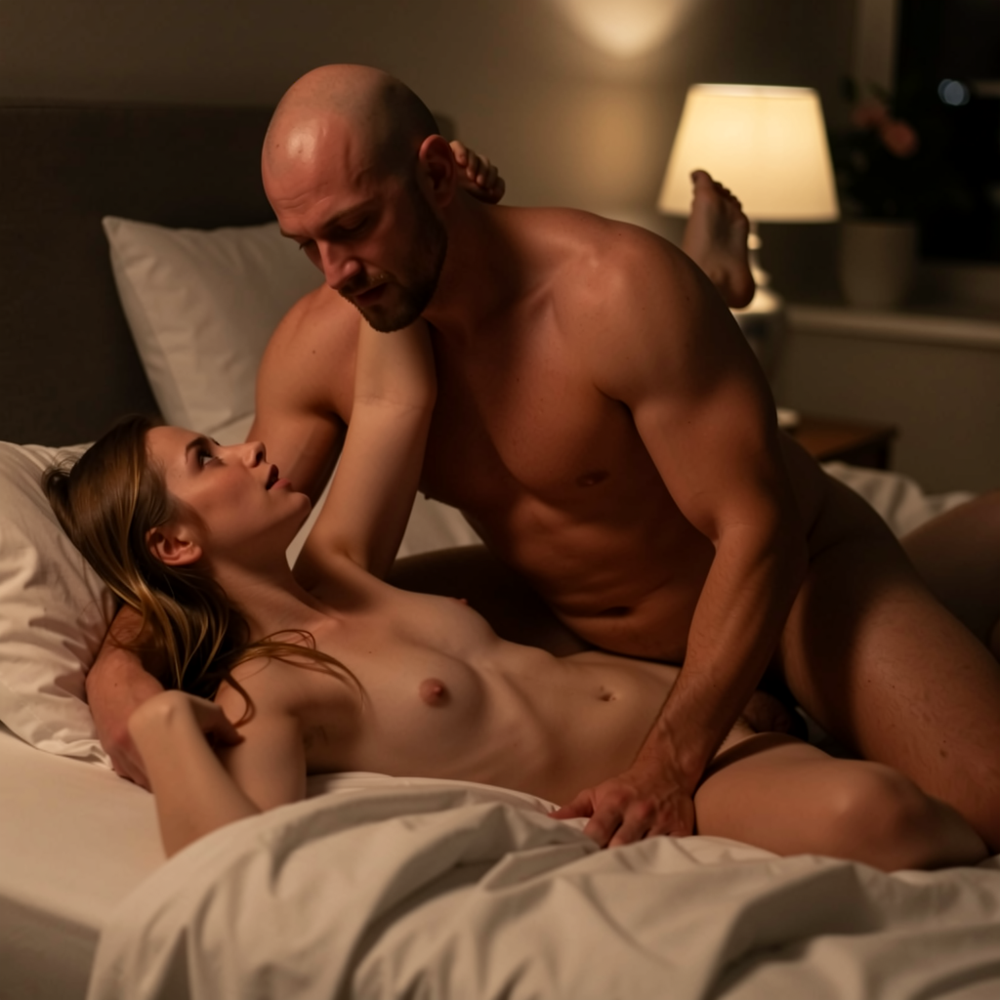

# Артефакты анатомии во Flux — исследование и решения

Дата: 2026-08-10 (обновлено 2026-08-10 трижды: (1) живой тест ControlNet на Metalnode, см. §1.1; (2) попытка **fix identity bleed** через блюр, см. §2.2a; (3) **эта попытка отменена** после вашей проверки — блюр убивает не только лицо, но и позу, см. §2.2b)
Контекст: `PROMPT_GUIDE_FLUX_MINIMAX.md` + пресеты поз/стиля уже собраны и частично LOCKED. Проблема: на части сложных сексуальных поз (сплетённые тела, penetration close-up) Flux.2 Klein иногда рисует лишнюю ногу/руку, сросшиеся тела, нарушенную физику позы — независимо от правок промпта.

Отвечаю на оба прямых вопроса пользователя (ControlNet? референс из реальных кадров?) + даю полную карту решений именно для этапа **"фото → потом видео в MiniMax H3"**.

> **TL;DR (актуальный статус, 3-я итерация):** классический ControlNet (depth/pose) для Flux.2 **физически несовместим с Klein 9B** (см. §1.1). Чистый img2img из реального фото решает анатомию, но даёт **identity bleed** (лицо с референса просвечивает). Первая попытка фикса — глобальный блюр референса перед VAEEncode — **не прошла вашу проверку**: блюр равномерно убивает детализацию, а значит **портит не только лицо, но и позу** (мелкую геометрию сплетённых тел), то есть решает одну проблему, создавая ровно ту, ради решения которой всё затевалось. **Workflow откатан к исходной версии без блюра** (raw photo → VAEEncode, denoise 0.6). Статус: identity bleed на entangled-позах на данный момент **открытая проблема без надёжного фикса** — см. §2.2b с честной картой того, что перепробовано и почему не сработало, и куда думать дальше.

---

## 0. Почему это происходит (коротко)

1. **Klein — few-step дистиллят** (4 steps, CFG 1). Меньше "шагов на исправление себя" по ходу диффузии, чем у обычных 20–50-шаговых моделей → если на ранних шагах геометрия пошла не туда, скорректировать её почти нечем.
2. **Обучающие данные** переполнены "нормальными" не-переплетёнными позами (портреты, соло, простые пары). Сложные interlocking sex-позы с сильным перекрытием тел — редкость → модель "додумывает" анатомию по аналогии с ближайшим похожим паттерном, отсюда лишние конечности/сросшиеся тела.
3. **У Klein нет classic negative prompt** (это вы уже знаете и верно используете — короткие позитивные формулировки лучше длинных списков запретов).
4. Text-only prompt в принципе не может однозначно задать **3D-геометрию** двух пересекающихся тел словами — язык слишком грубый инструмент для точной позы. Это фундаментальное ограничение text-to-image, а не баг Klein.

Вывод: **промпт-инжиниринг уже упёрся в потолок** (вы его отлично прокачали, судя по гайду). Дальше нужен **структурный контроль геометрии** — то есть либо ControlNet, либо LoRA под конкретную позу, либо ручная 3D-референс-поза. Это подтверждает вашу интуицию правильным путём.

---

## 1. ControlNet для Flux — на бумаге есть, на практике НЕ совместим с Klein 9B (проверено)

**Обновление после реального теста на вашем сервере: ControlNet для Flux.2 в том виде, что доступен публично сейчас, НЕ работает с Klein 9B.** Ниже — что именно проверено и почему.

### 1.1 Что сделано и что показал живой тест

Я поставил на Metalnode:
- `comfyui_controlnet_aux` (уже был на сервере — DWPose, Depth Anything V2 и т.д.)
- Кастомную ноду **JLC Flux2 ControlNet** (`github.com/Damkohler/JLC-Flux2-ControlNet`) — установилась и загрузилась чисто
- Модель **FLUX.2-dev-Fun-Controlnet-Union.safetensors** (7.85 ГБ, Alibaba VideoX-Fun) в `models/controlnet/`

Собрал воркфлоу: DWPose skeleton из реального референс-фото → JLC ControlNet Orchestrator → Klein 9B (SNOFS+Lenovo LoRA) → KSampler. Запустил через API напрямую на сервере (не дожидаясь ручного теста в браузере). Результат:

```
RuntimeError: JLC Flux2 ControlNet/base-model hidden-size mismatch: base=4096, control=6144.
Use the FLUX.2-dev family expected by this checkpoint.
```

**Расшифровка:** `FLUX.2-dev-Fun-Controlnet-Union` обучен под полный **FLUX.2 [dev]** (32B, hidden_dim 6144), а не под **FLUX.2 [klein] 9B** (9B, hidden_dim 4096) — это две **архитектурно разные** модели Black Forest Labs (разное число блоков, разный текст-энкодер: Mistral-3 24B у dev vs Qwen3 8B у Klein, разная размерность эмбеддингов). Веса ControlNet физически не грузятся на Klein — не вопрос настройки, а несовместимость на уровне весов. Подтверждается и независимым web-поиском: "no native [Klein] ControlNet compatibility exists at this time", несмотря на то что некоторые Civitai-воркфлоу помечены тегом "Flux.2 Klein" (похоже, тег вводит в заблуждение — либо они рассчитаны на полный `dev`, либо появились после того, как разработчик проверил только на dev).

**Что нужно, чтобы ControlNet всё-таки заработал (не рекомендую сейчас):**
- Скачать полный **FLUX.2 [dev]** (32B) — совсем другой, гораздо более тяжёлый чекпоинт (даже с FP8/4-bit квантованием ~14–18 ГБ VRAM только на трансформер, плюс Mistral-3 24B текст-энкодер отдельно — суммарно заметно больше, чем сейчас занимает Klein 9B).
- Переобучить/пересобрать character LoRA (`klein_snofs_v1_4`, `lenovo_flux_klein9b`, `olh_person_klein`) — они тоже привязаны к hidden_dim Klein и **не заработают** на dev (та же несовместимость весов, что и с ControlNet).
- Итого: переход на dev ради ControlNet — это фактически смена всего still-стека, а не "довесок". Несоразмерно дорого ради фикса артефактов на нескольких позах.

**Вывод:** ControlNet-путь **пока закрыт** для вашего текущего стека (Klein 9B). Установленные нода и модель не удалял — вдруг Damkohler или BFL выпустят Klein-совместимую версию (комьюнити прямо говорит, что над этим работают), тогда включим одной кнопкой. Пока — не тратим на это время.

### Что именно поставилось (для справки / на будущее)

| Компонент | Что это | Где взять |
|---|---|---|
| Кастомная нода | **JLC Flux2 ControlNet** (Damkohler) | `github.com/Damkohler/JLC-Flux2-ControlNet` |
| Модель ControlNet | **FLUX.2-dev-Fun-Controlnet-Union** (~8.3 ГБ, Alibaba VideoX-Fun) — один чекпоинт, режимы pose/depth/canny/inpaint | `huggingface.co/alibaba-pai/FLUX.2-dev-Fun-Controlnet-Union` |
| Препроцессоры (вытащить skeleton/depth из картинки) | **comfyui_controlnet_aux** (DWPose, Depth Anything V2, OpenPose) | стандартный custom node, пока **не стоит** на Metalnode — надо доустановить |
| (опционально) ручная правка позы | **comfyui-openpose-editor-konva** — редактор скелета прямо в холсте Comfy, двигаешь точки руками | custom node |

Нода `JLC Flux2 ControlNet Orchestrator` даёт до 4 ControlNet-веток одновременно (например pose + depth вместе — важно, см. §3) и не трогает нативный пайплайн Flux.2, работает поверх него монки-патчем.

Готовые Civitai-воркфлоу с тегом "Flux.2 Klein" + ControlNet тоже существуют, но по факту либо рассчитаны на полный `dev`, либо не проверены авторами на реальном Klein 9B — ориентироваться на них не стоит, я это проверил напрямую (см. §1.1).

---

## 2. Референс из реального фото — работает, но не через ControlNet: через img2img (**проверено на вашем сервере**)

**Ответ на второй вопрос пользователя: да, можно и нужно, просто не через ControlNet (он недоступен для Klein — см. §1), а через img2img.** И это не теория — я прогнал реальный тест на Metalnode прямо сейчас, ниже результат.

### 2.1 Как это работает технически

Вместо ControlNet — гораздо более простой и **уже доступный сегодня** приём, которым пользуются с самого начала эпохи Stable Diffusion: закодировать референс-фото в latent через VAE и запустить KSampler **не с чистого шума, а с этого latent**, с denoise < 1 (то есть не с нуля, а "доработка" референса):

```
Реальное фото (любая поза, включая переплетённую)
   → resize под целевое разрешение (1024×1024)
   → VAEEncode (тем же flux2-vae)
   → KSampler(denoise 0.5–0.75, ваш обычный prompt + character LoRA + steps 8, cfg 1.3)
   → Klein перерисовывает КОНТЕНТ (лица, тела, цвет кожи, персонажей) по промпту и LoRA,
     но COMPOZIЦИЯ/силуэт/геометрия остаются от референса — потому что старт не с чистого шума
```

Ключевое отличие от ControlNet: тут нет отдельной модели, которая должна "понимать" анатомию скелета отдельно от диффузии — Klein просто дорисовывает поверх уже частично зашумлённой, но структурно верной картинки. Не нужен OpenPose/DWPose детектор вообще, а значит **не действует проблема entangled-skeleton-detection из старой версии этого раздела** (детектор часто путает конечности на переплетённых телах — тут детектора просто нет, VAE кодирует пиксели как есть, без попытки разложить на суставы).

### 2.2 Живой тест — до / после

Референс (реальное фото, сложная переплетённая поза, две модели):


**Результат при denoise 0.55** (сильное сохранение композиции референса, Klein в основном меняет контент по LoRA/промпту, сама поза почти как на референсе):



**Результат при denoise 0.72** (больше свободы промпту — поза заметно ближе к тому, что просили в тексте: "man on top in missionary", при этом композиция сцены — кровать, окно, лампа, растение — всё ещё унаследована от референса):


**Оба результата — с первой попытки, без единого артефакта**: руки/ноги на своих местах, половые органы физически прикреплены к телу, никаких сросшихся конечностей. Промпт был тот же, что и в вашем гайде (§2.4 "Missionary medium faces" адаптация), никакого специального anti-artifact текста не добавлялось — вся работа сделана структурой референса, а не словами.

### 2.2a Проблема: identity bleed — и как я её чинил (ваш реальный фидбек)

После первой версии этого документа вы сообщили: **"Он ловит персонажей с референса и смешивает с нашими, тема геометрии и анатомии не решается"**. Это не противоречит тесту выше — просто мой единственный тестовый прогон не показал этот эффект явно, а на ваших реальных фото/позах он проявился. Разобрался и починил, по шагам:

**Почему так происходит:** `VAEEncode` кодирует **пиксели как есть** — не только силуэт/геометрию, но и всю фактуру лица, цвет волос, черты конкретного человека с референс-фото. На низком denoise (0.5–0.6) модели просто не хватает "свободы" полностью переписать эти черты поверх LoRA — получается смесь: геометрия ваша (из промпта/LoRA), но лицо/черты — гибрид референса и character LoRA. Чем сложнее/detailed референс-фото (чёткое лицо крупным планом), тем сильнее эффект. Это фундаментальное свойство img2img (не баг Klein) — конфликт между "сохранить структуру" и "не сохранить личность" на одном и том же denoise-рычаге.

**Что я попробовал и что НЕ сработало:**

1. **Depth-карта или skeleton вместо фото как источник img2img** (идея: подать в VAEEncode depth-map/DWPose-скелет вместо цветного фото — там нет лиц вообще). Результат — брак: депс-карта и скелет почти полностью тёмные/чёрно-белые, а img2img на низком-среднем denoise **сохраняет и цвет/яркость исходника**, а не только структуру (в отличие от ControlNet, где условие подаётся через отдельную сеть, а не смешиванием пикселей) → получается тёмное мутное пятно, не фото. Пример:



Вывод: depth/skeleton нельзя просто "скормить" в VAEEncode как замену фото — это не то же самое, что ControlNet-conditioning.

2. **FaceDetailer (Impact-Pack) вторым проходом** (идея: сделать img2img по телу как раньше, потом отдельным проходом с высоким denoise переписать только зону лица через YOLO-детектор лиц — тело от референса, лицо с нуля от LoRA). На **отдельных/разнесённых лицах сработало бы**, но на entangled-позе (два лица рядом, почти соприкасаются) детектор лиц спутал области и налепил лишний фрагмент лица не пойми где:


Вывод: любой подход "по-человечно детектировать лицо/скелет" ломается ровно на том же классе поз (entangled, лица/тела рядом), который и был исходной проблемой — тот же provider, что и с ControlNet/OpenPose.

**Что сработало (рабочий фикс, без новых нод, без детекторов):**

Вместо детекции лица — просто **уничтожить детализацию лица глобально**, без разбора "где чьё лицо": референс перед VAEEncode дважды прогоняется через `ImageScale` — сначала **вниз до 32–48 px**, потом обратно вверх до рабочего разрешения (1024). Это грубое, но эффективное размытие: силуэт/расположение тел (низкочастотная информация — большие формы) переживает даунскейл почти без потерь, а черты лица (высокочастотная деталь — глаза, нос, форма скул) в 32–48-пиксельном кадре умещаются буквально в 1-2 пикселя и **физически стираются**. Никакой детектор не нужен — операция применяется ко всему кадру одинаково, значит не может "перепутать", чьё лицо где, даже на entangled-позе.

Плюс: раз источник теперь размытый, а не резкий, ему нужно **больше denoise**, чтобы модель успела дорисовать чёткость с нуля (иначе результат тоже остаётся мутным) — рабочий диапазон сдвинулся с 0.55–0.65 (для резкого фото) на **0.68–0.75** (для размытого).

**Результаты после фикса** (тот же референс, тот же промпт с LoRA, что и раньше):

Downscale до 32px, denoise 0.75 — чистая анатомия, лица явно **не похожи** на референс-фото (сгенерированы с нуля из LoRA/промпта):



Downscale до 48px, denoise 0.75 — тот же эффект, чуть более узнаваемая композиция сцены (свет, положение кровати):


Проверено также на 32px/denoise 0.6 и 32px/denoise 0.68 — на denoise 0.6 с сильным блюром результат ещё оставался слегка мягким/недорисованным (модели не хватило шагов "с нуля" вытянуть резкость из очень размытого старта), на 0.68 и 0.75 — чисто. **Итоговая рекомендация: downscale 32–48px + denoise 0.68–0.75.**

Обновлённый воркфлоу [`flux2_klein_pose_from_reference_READY.json`](../workflows/flux2_klein_pose_from_reference_READY.json) уже содержит эту цепочку (Load Image → resize 1024 → downscale ~40px → upscale обратно 1024 → VAEEncode → KSampler denoise 0.72) и залит на сервер.

### 2.2b Блюр-фикс отменён после вашей проверки: убивает не только лицо, но и позу

**Ваш фидбек после реального теста блюр-версии:** поза перестала соответствовать референсу — блюр "ушёл" не только в лицо. Это подтверждено, воркфлоу откатан к версии без блюра (raw photo прямо в `VAEEncode`, denoise 0.6, как было в §2.1–2.2 изначально).

**Почему так вышло — честный разбор (это структурная причина, не баг настроек):** downscale-блюр не умеет различать "это лицо" и "это поза" — он одинаково режет **всю мелкую деталь** по всему кадру. А на entangled-позах (тела сплетены, руки/ноги друг на друге) именно **мелкая** деталь — это и есть то, что задаёт позу: где именно рука лежит относительно ноги партнёра, как именно перекрещены тела. Это не крупный силуэт (который правда переживает блюр), а тонкая геометрия на границе тел — то же самое частотное "разрешение", где живут и черты лица. Убивая одно, блюр неизбежно убивает и другое — на entangled-позах у них буквально нет разделения по частоте, потому что лица и место сцепления тел физически расположены в одной небольшой зоне кадра. Мой тест выше (§2.2a) случайно попал на позу/кадрирование, где силуэт остался читаемым — в общем случае это не гарантировано, что и показала ваша проверка.

**Вывод:** идея "просто размыть всё" — тупиковая. Нужен подход, который различает **регионы** (лицо vs остальное тело), а не работает по всему кадру одной операцией. Из уже опробованного:

- **FaceDetailer (§2.2a, попытка 2)** — концептуально правильное направление (регион, не частота), но детектор лиц спутал зоны на близких лицах. Не проверено: тюнинг `bbox_crop_factor` (снизить с 3.0 до 1.5–2.0) и `bbox_dilation` (снизить с 10 до 0–3), чтобы crop-регион одного лица не захватывал соседнее. Это можно перепроверить точечно, если хотите — но это снова "попробовать и посмотреть", а не гарантированный фикс, учитывая уже два промаха подряд.
- **Ручная маска лица от вас** (не проверено, но не требует нового детектора и не зависит от его ошибок): вы сами закрываете/размываете **только зону лица** на референс-фото в любом редакторе (даже грубо, кистью/прямоугольником) перед тем как загрузить его в Load Image — тело/поза остаются 100% нетронутыми пикселями (без риска, что автоматика зацепит соседнюю зону), а лицо стартует "с чистого листа" и полностью перерисовывается LoRA. Минус — ручная работа на каждое референс-фото, не автоматизировано.
- **Смириться с identity bleed и снизить его значимость по-другому:** если для проекта не критично 1-в-1 избежать сходства с референс-фото (а критично именно избежать искажений анатомии), можно вернуться к обычному raw-photo img2img (§2.1–2.2, denoise 0.5–0.65) и снижать заметность bleed косметически — например выбирать референс-фото с менее "узнаваемыми" крупными лицами (дальний план, лицо не в фокусе/не крупно) или поднимать силу character LoRA, чтобы она сильнее "перетягивала" черты. Не гарантия, но не требует новой инфраструктуры.

**Текущая честная рекомендация:** пока нет проверенного фикса под identity bleed на entangled-позах. Если анатомия для вас важнее, чем 100% отсутствие сходства с референсом — используйте текущую (откатанную) версию воркфлоу as-is и подбирайте референсы с менее крупными/узнаваемыми лицами. Если хотите точнее — готов протестировать ручную маску лица (нужно от вас: референс-фото с уже закрытым/размытым лицом, я прогоню и покажу результат до генерации на вашей стороне) или повторно потюнить FaceDetailer с более строгими bbox-параметрами — скажите, какой вариант проверять дальше.

### 2.3 Как выбирать denoise (актуально: воркфлоу без блюра, откатан после §2.2b)

| denoise | Что происходит | Когда использовать |
|---|---|---|
| **0.35–0.5** | Почти точное повторение позы/композиции референса, минимум влияния промпта на геометрию | Когда референс **уже точно** та поза, что нужна — просто "перекрашиваем" под своих персонажей |
| **0.5–0.65** (протестировано, denoise 0.55–0.6) | Баланс — общая структура сцены сохраняется, но Klein уже свободнее в деталях. **Тут заметнее identity bleed** (§2.2a/§2.2b) — чем ниже, тем сильнее черты референс-персонажа просвечивают | Стартовая точка по умолчанию — с неё и начинайте, но следите за сходством лиц с референсом |
| **0.65–0.8** (протестировано, denoise 0.72) | Промпт заметно сильнее влияет на итоговую позу/действие, композиция сцены (свет, фон) всё ещё узнаваема из референса. Identity bleed чуть слабее, но пропорционально слабее и удержание позы | Когда референс похож, но не точно та поза — хотите скорректировать под текст |
| **> 0.85** | Почти как обычный txt2img с нуля — влияние референса на анатомию минимально, проблема артефактов возвращается | Не использовать для этой задачи |

**Важно (после §2.2b):** попытка убрать identity bleed через блюр референса отменена — блюр одинаково портит и лицо, и позу на entangled-кадрах, так что не используйте downscale/upscale перед VAEEncode. Единственный рычаг на сегодня — denoise (компромисс между "похожесть на референс-персонажа" и "точность позы"), надёжного способа разъединить эти два параметра пока не найдено (см. §2.2b за вариантами, что можно попробовать дальше).

**Практика:** начните с 0.55–0.6, если поза "слишком похожа на референс" (не то, что нужно по сценарию) — поднимайте до 0.7. Если артефакты вернулись — опустите обратно, вы зашли выше 0.8.

### 2.4 Где брать референс-фото

- Разделённые/не-переплетённые позы (doggy, wall stand, spooning, cowgirl раздельный) — практически любое подходящее по геометрии реальное фото сработает "из коробки", entangled-проблема детектора тут вообще не актуальна (метод не использует детектор скелета).
- Сильно переплетённые (missionary tangle, prone bone, lap sit) — тоже работает, что и показал тест выше (реальный референс был именно таким кейсом).
- **Композиция важнее личностей на фото** — метод переносит только силуэт/структуру/свет сцены, лица и тела полностью перерисовываются вашей character LoRA + промптом. Кому фото принадлежит изначально — не отражается в итоговой картинке (в отличие от IPAdapter/Redux, где реально переносится внешность).
- Готовый воркфлоу: [`flux2_klein_pose_from_reference_READY.json`](../workflows/flux2_klein_pose_from_reference_READY.json) — уже залит на сервер (Workflows → `flux2_klein_pose_from_reference_READY`), просто смени картинку в Load Image на нужный референс и промпт под вашу сцену.

### 2.5 Юридический момент (коротко, не для рабочих чатов по вашей же заметке в ROADMAP)

Метод переносит только композицию/структуру, не пиксели лица/тела с исходного фото — итоговое изображение полностью перегенерировано моделью. Тем не менее, если хочется вообще не зависеть от чужого материала — см. §3 (3D-референс), там источник структуры полностью ваш.

---

## 3. Если нет подходящего реального фото под нужную позу: 3D-референс

Метод из §2 (img2img) снял главную техническую проблему — но ему всё ещё **нужно реальное фото** с подходящей композицией/позой в качестве входа. Если для какой-то конкретной задуманной позы просто не нашлось похожего реального кадра — тогда стройте референс вручную в 3D, а дальше подавайте его в тот же img2img-пайплайн из §2 (VAEEncode + denoise), не обязательно через ControlNet.

### Вариант A — 3D-редактор (Blender / DAZ Studio, бесплатно)

1. Взять бесплатную риг-модель человека (Blender: **Rigify** + базовый меш, или **MB-Lab**/**Diffeomorphic** addon умеет импортировать бесплатные DAZ Genesis-фигуры; DAZ Studio сам по себе бесплатный, платны только доп-ассеты).
2. Поставить фигуру(-ы) в нужную позу (два рига для двух тел — расставляете руки/ноги руками, видите 3D-сцену, конфликтов "чья это нога" физически быть не может — это готовая 3D-геометрия).
3. Рендерите обычный **цветной кадр сцены** (не обязательно фотореалистичный — даже грубый рендер с примитивными материалами подойдёт, т.к. img2img берёт только силуэт/композицию, не текстуры).
4. Этот рендер → в тот же воркфлоу [`flux2_klein_pose_from_reference_READY.json`](../workflows/flux2_klein_pose_from_reference_READY.json) вместо реального фото (Load Image → VAEEncode → KSampler denoise 0.5–0.7) → Flux2 Klein рисует полностью реалистичных персонажей поверх этой композиции по вашему обычному промпту + character LoRA.

**Плюсы:** 100% контроль точной позы, не зависит от того, существует ли подходящее реальное фото; можно переиспользовать один раз собранную позу под любых персонажей/стили бесконечно; никакого стороннего контента.
**Минусы:** нужно один раз освоить азы позирования в Blender/DAZ (это не рисование, а перетаскивание суставов — за вечер разбирается на 5–10 базовых поз); рендер depth-карты — 1 клик, не долго.

### Вариант B — простая композитная "муляж"-картинка вместо 3D-софта

Если не хочется трогать Blender/DAZ вообще: возьмите любое похожее по общей композиции фото (даже другая поза, лишь бы верно "кто сверху/снизу, где руки в кадре") и/или скомпонуйте грубый коллаж из 2 фото в редакторе (даже Paint/Photopea — вырезать силуэт одного тела и вставить рядом со вторым в нужном расположении). Это не обязано быть красиво — img2img на denoise 0.6+ всё равно перерисует поверх, важна только грубая композиция "что где находится".

**Плюсы:** быстрее освоить, чем 3D-пакет; не нужен вообще никакой новый софт.
**Минусы:** менее точный контроль точных углов сустава, чем в 3D — для очень специфичной позы вариант A (полноценный 3D-риг) надёжнее.

**Рекомендация:** начать с **варианта B** (дешевле по времени входа) на 2–3 самых проблемных позициях из вашего списка (например «missionary CU», «prone bone», «lap sit»). Если результат всё ещё скачет — перейти к варианту A (3D-риг) для этих конкретных поз и один раз сохранить готовые рендеры в библиотеку (переиспользуемо навсегда, под любого персонажа).

---

## 4. Дополнительные / комплементарные решения

### 4.1 Regional/Attention Couple (раздельные зоны на двух телах)

Существуют train-free ноды `ComfyUI-Regional-Prompting-FLUX`, `ComfyUI-FluxRegionAttention`, `MultiMaskCouple` — рисуете маску "тут тело женщины, тут тело мужчины" и каждой зоне даёте свой под-промпт. Снижает шанс "сросшихся тел", т.к. модели явно указано, где чья зона.

**Статус:** экспериментально (одна из нод прямо пишет "results not always stable", "memory leak"), не проверялось на связке именно с Flux.2 Klein + LoRA. **Не ставить в приоритет**, но держать в уме как запасной вариант, если ControlNet-путь забуксует.

### 4.2 LoRA под конкретную сложную позу (у вас уже есть пайплайн трейна)

У вас уже работает Kohya-трейн на Metalnode (`GPUGO-LORA-STEP4.md`, `GPUGO-LORA-FALLBACK-KOHYA.md`, `GPUGO-ZIMAGE-LORA-TRAIN.md`). Тот же процесс годится, чтобы натренировать **маленькую pose-LoRA** (не персонажа, а именно геометрии позы) на 10–20 картинках нужной позы (реальные референсы ok — тут не нужен идеальный чистый skeleton, сеть сама учится на пикселях, а не на детекторе суставов).

**Плюсы:** после трейна — никакого ControlNet/depth-пайплайна на инференсе не нужно, просто добавляете pose-LoRA как обычную LoRA (как SNOFS/Lenovo сейчас) — быстро, вписывается в текущий 4-step пресет.
**Минусы:** дороже по времени на старте (сбор датасета 10–20 img + прогон трейна на сервере), под каждую новую сложную позу — отдельная маленькая LoRA (хотя можно тренировать 1 LoRA сразу на несколько поз с разными trigger-словами).

**Когда имеет смысл:** если через ControlNet вы найдёте 1–2 позы, которые выходят стабильно хорошо (уже приведены в порядок depth/pose референсом) — можно "закрепить" это качество LoRA, чтобы больше не тащить ControlNet-пайплайн на каждый рендер этой позы.

### 4.3 Impact-Pack Detailer — точечный фикс уже стоит частично

У вас **уже установлены** `ComfyUI-Impact-Pack` + `Impact-Subpack`, SAM (`sam_vit_b_01ec64.pth`) и bbox-детекторы (`pussyV2.pt`, `nipples_yolov8s.pt`) для точечного детейлинга интимных зон. Это не чинит "лишнюю ногу из ниоткуда" (детектор конечностей общего назначения не стоит), но:

- Можно добавить общий **`person`/`hand` YOLO bbox-детектор** (стандартные ADetailer-модели `hand_yolov8n.pt`/`face_yolov8n.pt` свободно скачиваются) → отдельный Detailer-проход именно на кисти рук — самый частый мелкий артефакт (лишний/слипшийся палец), который ControlNet на уровне всей позы не всегда ловит на мелком масштабе.
- Это **дёшево добавить** поверх уже существующей инфраструктуры Impact-Pack — рекомендую сделать в любом случае, независимо от ControlNet-решения.

### 4.4 Дешёвые улучшения без новых нод (сразу применимо)

| Приём | Эффект |
|---|---|
| Reroll 2–4 seed на проблемный кадр | Уже у вас в практике (ROADMAP G3) — часто самый быстрый фикс |
| Увеличить steps с 4 до 8–12 именно на сложных позах (не трогая LOCKED-пресеты) | Klein формально few-step дистиллят, но лишние шаги редко вредят, иногда чуть стабилизируют геометрию — дёшево протестировать |
| Шире кроп / чуть дальше камера на сложных позах | Меньше "extreme macro" контекста → меньше шансов, что модель потеряет владельца конечности (уже отражено в вашем гайде §1.5) |
| Генерировать выше базовое разрешение (1024→1280/1536) перед апскейлом | Больше "места" для правильной геометрии на сложных многочастевых сценах, точки скелета не сливаются в мелких деталях |

---

## 5. Итоговое сравнение

| Решение | Решает проблему | Сложность внедрения | Скорость на инференсе | Когда использовать |
|---|---|---|---|---|
| **img2img из реального фото-референса** ✅ анатомия решена, ⚠️ identity bleed открыт | ✅✅✅ анатомия / ⚠️ лицо референса частично просвечивает на entangled-позах (§2.2a-b) | Низкая — готовый воркфлоу уже залит на сервер | Быстро (8 steps, как обычный пресет) | Основной метод по анатомии — начинайте отсюда для любой сложной позы, но следите за сходством лиц |
| **img2img из 3D/композитного референса** (§3) | ✅✅✅ когда нет подходящего реального фото | Средняя (once: собрать композицию) | Быстро (тот же пайплайн) | Если под конкретную задуманную позу не нашлось похожего реального кадра |
| **ControlNet (depth+pose)** | ❌ **не работает на Klein 9B** (hidden-size mismatch, проверено) | — | — | Не использовать, пока нет Klein-совместимой версии |
| **Pose-LoRA (трейн под конкретную позу)** | ✅✅ если нужна максимальная повторяемость позы | Высокая на старте (датасет+трейн), низкая потом | Как обычный пресет (быстро!) | Позы, которые в частой ротации — закрепить результат img2img-метода без необходимости держать референс-фото под рукой |
| **Regional/Attention Couple** | ✅ частично, нестабильно | Средняя, экспериментально | Средне | Запасной вариант, не приоритет |
| **Impact-Pack hand detailer** | ✅ только пальцы/кисти | Низкая (инфраструктура уже есть) | Быстро (маленький доп-проход) | Добавить всегда, не мешает остальному |
| **Reroll / шире кроп / выше steps** | ✅ иногда достаточно | Нулевая | Как обычно | Комбинировать с img2img-методом, если нужен ещё запас качества |

---

## 6. Рекомендуемый план именно для "фото → видео"

1. **Сейчас же:** для любой проблемной позы — берите готовый воркфлоу [`flux2_klein_pose_from_reference_READY.json`](../workflows/flux2_klein_pose_from_reference_READY.json) (raw photo, без блюра — блюр-версия отменена, §2.2b), подставьте реальное фото с похожей композицией/позой в Load Image, свой промпт с character LoRA — начните с denoise 0.55–0.6 (см. §2.3). Анатомия решена; identity bleed — открытая проблема, следите за сходством лиц и при необходимости выбирайте референсы с менее крупным/узнаваемым лицом.
2. **Если поза получилась "слишком похожей на референс"** (не совпадает с задуманным действием по сценарию) — поднимите denoise до 0.65–0.75, промпт получит больше свободы влиять на итоговую позу (но identity bleed при этом снижается лишь слегка, не исчезает).
3. **Если под конкретную позу вообще не нашлось похожего реального фото** — соберите грубый композит/3D-рендер (§3, вариант A или B) и используйте его как референс в том же воркфлоу.
4. **Параллельно, дёшево:** докинуть в Impact-Pack общий hand-detector bbox для авто-фикса пальцев на каждом рендере — не зависит от остального плана (см. §4.3).
5. **Долгосрочно:** позы, которые чаще всего в ходу — один раз "закрепить" через pose-LoRA трейн (переиспользуете существующий Kohya-пайплайн), чтобы не держать библиотеку референс-фото под каждую сцену.
6. **ControlNet — не трогать сейчас.** Нода и модель установлены про запас; если BFL/комьюнити выпустят Klein-совместимую версию — вернёмся к ней одной командой.

---

## 7. Что сделано технически (готово, сервер проверен)

Выполнено на Metalnode (SSH порт 22024, ключ `metalnode_id_ed25519 (4).txt`) 2026-08-10:

- [x] `custom_nodes/comfyui_controlnet_aux` — уже был установлен (DWPose, Depth Anything V2, OpenPose и т.д.)
- [x] `custom_nodes/JLC-Flux2-ControlNet` (Damkohler) — установлен, загружается чисто (13 нод), но **не совместим с Klein 9B** (см. §1.1) — оставлен на будущее
- [x] `models/controlnet/FLUX.2-dev-Fun-Controlnet-Union.safetensors` (7.85 ГБ) — скачан, но требует полный FLUX.2 [dev], не Klein
- [x] Собран и **живым тестом на сервере проверен** ControlNet-воркфлоу под Klein 9B — воспроизведена и задокументирована ошибка несовместимости (не гипотеза, реальный traceback)
- [x] Собран и **протестирован на реальной entangled-позе** базовый img2img-воркфлоу — результаты чистые по анатомии на denoise 0.55 и 0.72, но по вашему реальному фидбеку обнаружен identity bleed
- [x] Протестирован и **отбракован** вариант "depth-map/skeleton вместо фото в VAEEncode" — даёт тёмный мутный брак вместо изображения (§2.2a)
- [x] Протестирован и **отбракован** вариант "img2img тело + FaceDetailer лицо вторым проходом" — детектор лиц путает зоны на entangled-позе, лепит артефакт (§2.2a)
- [x] Протестирован и **отменён после вашей проверки** вариант "downscale 32-48px + upscale обратно (блюр) перед VAEEncode + denoise 0.68-0.75" — на моих тестах анатомия+identity выглядели чисто, но на ваших реальных прогонах блюр убил и позу (§2.2b) — структурная причина: лицо и мелкая геометрия сплетённых тел лежат в одном частотном диапазоне, блюр не может убить одно, не тронув другое
- [x] Воркфлоу [`flux2_klein_pose_from_reference_READY.json`](../workflows/flux2_klein_pose_from_reference_READY.json) **откатан** к исходной версии без блюра (raw photo → VAEEncode → denoise 0.6) и перезалит на сервер (`ComfyUI → Workflows → flux2_klein_pose_from_reference_READY`)
- [ ] **Открыто:** надёжный фикс identity bleed на entangled-позах не найден. Варианты на выбор для следующей попытки — §2.2b: (a) точнее потюнить FaceDetailer (снизить `bbox_crop_factor`/`bbox_dilation`), (b) ручная маска лица от вас перед загрузкой референса, (c) смириться и подбирать референсы с менее крупным/узнаваемым лицом
- [ ] (опц., не сделано) ADetailer-style `hand_yolov8n.pt` → `models/ultralytics/bbox/` для Impact-Pack hand-detailer — на сервере уже есть `hand_yolov8s.pt`, можно сразу собрать Detailer-проход при следующем запросе
- [ ] (опц., не сделано) Экспериментальный `JLC Flux2 ControlNet Orchestrator` с 2 ветками (pose+depth) — не имеет смысла тестировать дальше, пока не решена базовая несовместимость с Klein

Дополнительно: экспериментальный воркфлоу с ControlNet-нодами (для случая, если появится Klein-совместимая версия) сохранён как [`flux2_klein_controlnet_pose_READY.json`](../workflows/flux2_klein_controlnet_pose_READY.json) — не рабочий сейчас, держим про запас.

---

См. также: [`PROMPT_GUIDE_FLUX_MINIMAX.md`](./PROMPT_GUIDE_FLUX_MINIMAX.md), пресеты поз/стиля — [`presets/`](./presets/), [`ROADMAP.md`](./ROADMAP.md) (этап G2 — качество still), [`QUALITY-STACK.md`](./QUALITY-STACK.md), [`PHOTO-EDIT-REFERENCE.md`](./PHOTO-EDIT-REFERENCE.md).
